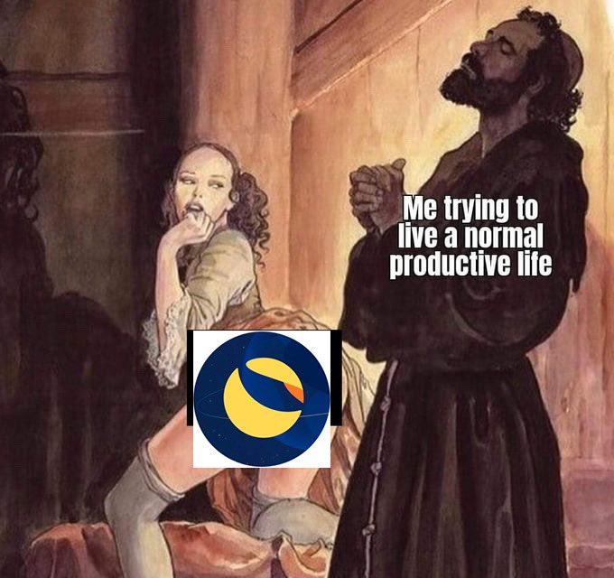

# ambiel • [](https://github.com/abigger87/ambiel/actions/workflows/tests.yml)   


Lightweight, Gracefull Push + Pull Pattern Demo.

## Getting Started


## Environment

**Setup**
```bash
make
# OR #
make setup
```

**Building**
```bash
make build
```

**Testing**
```bash
make test
```


### First time with Forge/Foundry?

See the official Foundry installation [instructions](https://github.com/foundry-rs/foundry/blob/master/README.md#installation).

Install the [foundry](https://github.com/gakonst/foundry) toolchain installer (`foundryup`) with:
```bash
curl -L https://foundry.paradigm.xyz | bash
```

Then simply execute to update/install all of foundry's juicy juicy tools:
```bash
foundryup
```

🎉 Foundry is installed! 🎉


### Configuration

Using [foundry.toml](./foundry.toml), Foundry is easily configurable.

For a full list of configuration options, see the Foundry [configuration documentation](https://github.com/gakonst/foundry/blob/master/config/README.md#all-options).

## License

[AGPL-3.0-only](https://github.com/abigger87/ambiel/blob/master/LICENSE)

## Acknowledgements

- [femplate](https://github.com/abigger87/femplate)
- [foundry](https://github.com/foundry-rs/foundry)
- [forge-std](https://github.com/foundry-rs/forge-std)

## Disclaimer

_These smart contracts are being provided as is. No guarantee, representation or warranty is being made, express or implied, as to the safety or correctness of the user interface or the smart contracts. They have not been audited and as such there can be no assurance they will work as intended, and users may experience delays, failures, errors, omissions, loss of transmitted information or loss of funds. The creators are not liable for any of the foregoing. Users should proceed with caution and use at their own risk._
